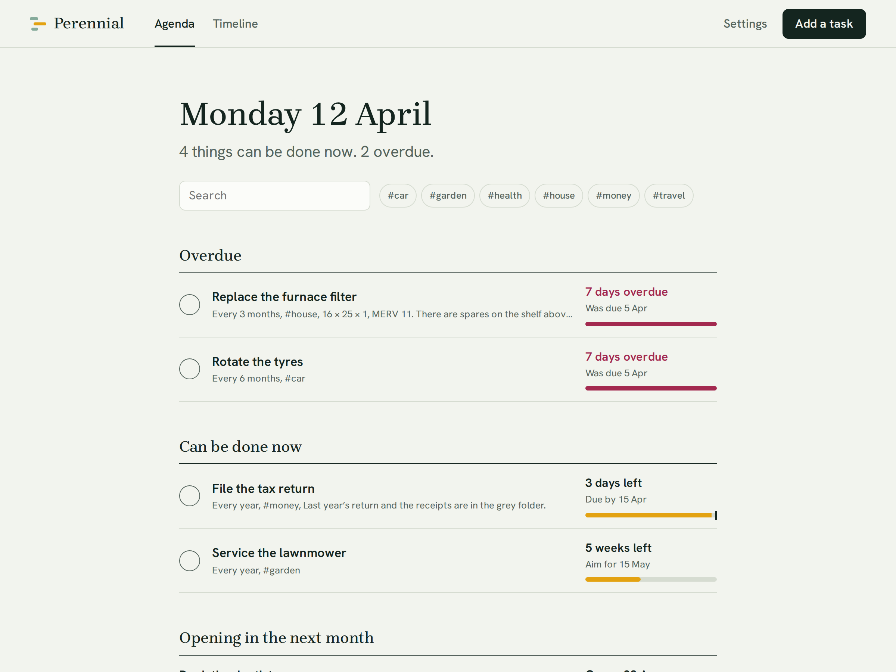
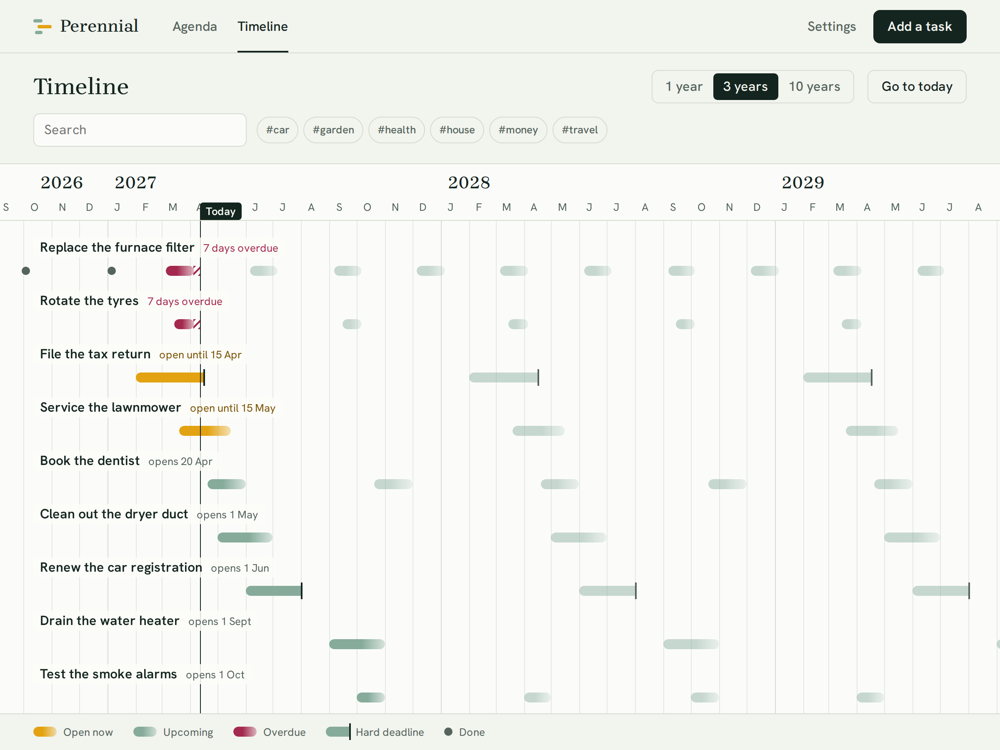
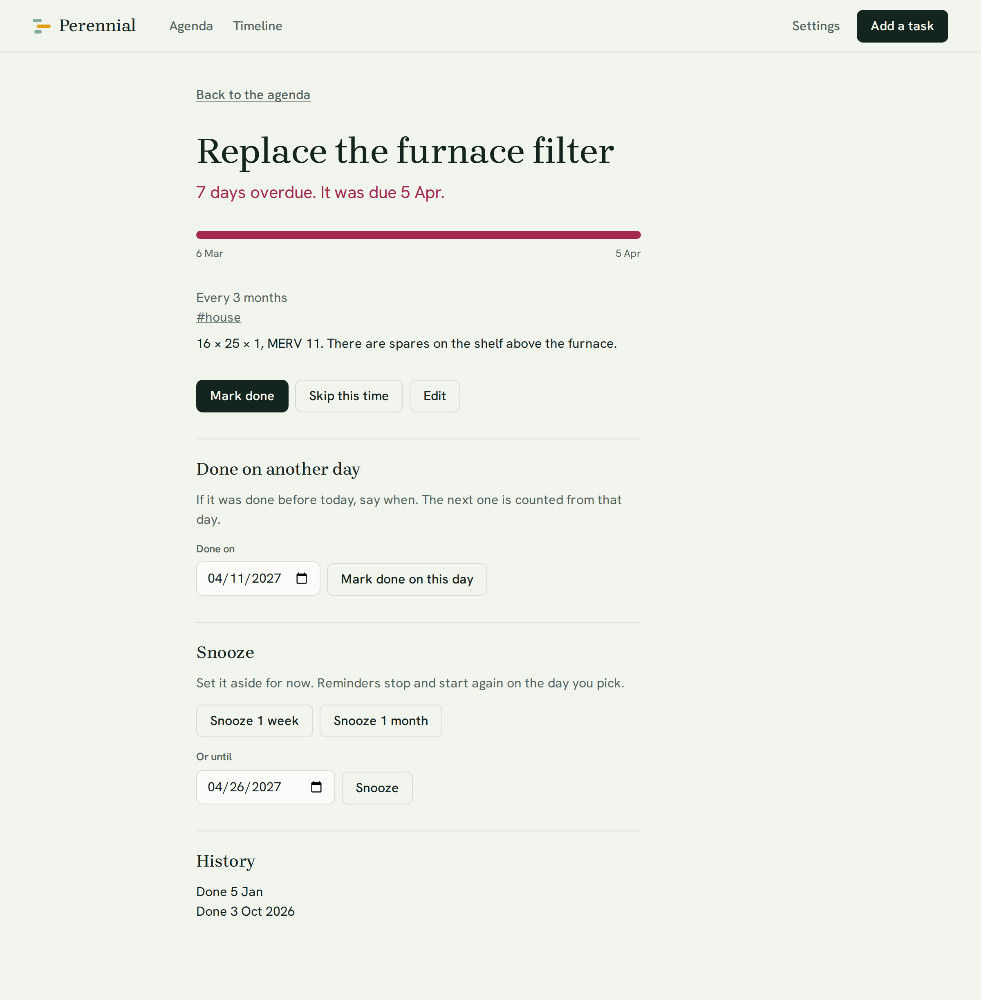

# Perennial

A self-hosted to-do list for the long term: the things that come around once a
year, or once a decade. Renew the passport. Drain the water heater. Clean out
the dryer duct.

An ordinary to-do list assumes a task can be done whenever. These can't. Each
has a **window**: a day it can first be started and a day it is due. Perennial
is built around that window.

- **Agenda** shows what can be done now, what is overdue, and what opens next.
- **Timeline** lays every window out across the coming months and years, so
  you can see a decade at a glance.
- Tasks **repeat** on a schedule ("every April") or from when they were last
  done ("three months after I change the filter").
  A task due on the 31st falls on the 28th in February and goes back to the
  31st in March.
- A deadline is either **hard** (the passport expires) or one that can slip.
- **Tags** group tasks (`#house`, `#car`), and **search** narrows the agenda
  and the timeline to a word or a tag.
- A task done last week but only ticked off today can be **marked done on the
  day it happened**, so its history and its next window are right.
- **Notifications** go to Discord, Slack, Telegram, or ntfy when a task opens,
  a week before it's due, on the day, and each week it stays overdue. Each
  links to the task, where you can mark it done or **snooze** it.

It is a single small container with a SQLite file, protected by one password.

<picture>
  <source media="(prefers-color-scheme: dark)" srcset="docs/screenshots/agenda-dark.png">
  
</picture>

<picture>
  <source media="(prefers-color-scheme: dark)" srcset="docs/screenshots/timeline-dark.png">
  
</picture>

<details>
<summary>A task's page</summary>

<picture>
  <source media="(prefers-color-scheme: dark)" srcset="docs/screenshots/task-dark.png">
  
</picture>

</details>

## Quick start

You need Docker with Compose.

```sh
git clone https://github.com/TaylorMichaelHall/perennial.git
cd perennial
cp .env.example .env
mkdir data
docker compose up -d
```

Open <http://localhost:3000> and choose a password.

## Documentation

- [Installation](docs/installation.md): passwords, configuration, updating, HTTPS
- [Notifications](docs/notifications.md): Discord, Slack, Telegram and ntfy
- [Your data](docs/data.md): backups, restoring, export and import
- [API](docs/api.md): managing tasks from scripts and AI agents
- [Development](docs/development.md): running it from source, tests, how it is put together

## License

[MIT](LICENSE)
